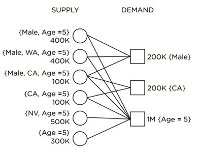

合约广告是一种基于合约的广告模式，在线广告中的一种主流方式是担保式投放（Guaranteed Delivery，GD）。GD是一种量优于质的广告投放方式，需要保证广告主能够获得在合约中约定的受众用户的流量。GD中，媒体的流量按照属性划分，媒体要给不同的广告主按照合同分配约定好的流量。Ad Server的准则是希望在每一次展现满足多个合约时，选择合适的广告主，以使得每个广告主效果最好，同时能够更有效的分配流量。如下图所示，supply为媒体方，提供流量，媒体的流量可以按照性别、年龄、地域划分；demand为广告主，不同的广告主需要不同细分的流量（或者说流量背后的用户），比如第一个广告主需要200K的男性流量。流量分配问题就是把不同细分的流量分配给不同的广告主，尽可能满足所有广告主的需求。比如下图中的问题，怎样把六部分流量分配给三个广告主才能满足所有广告合约的需求了？我们可以先分配CA的流量都给第二个广告主，然后就比较容易分配流量给另外两个广告主了。

对于上述问题的求解，已经有较多的工作展开，并且有一些不错的方法。为了理解不同方法的优点与弱点，需要先了解两个基本概念。第一个概念是流量到达顺序（input order），由于在实际广告分配中，我们不知道流量按照什么顺序达到，也不清楚会有哪些流量到达。显而易见的是，不同流量到达顺序对算法最终效果有很强的影响。为了更加客观的衡量不同算法的效果，需要比较在相同的流量到达顺序时，不同算法的效果。一般来讲对于流量到达顺序的模型有四种：

- 流量以最坏情况的顺序到达。这种流量到达模型假设有一个对手已经知道你的流量分配算法，并且对手可以操纵流量到达的顺序，从而产生一个使得你的流量分配算法效果最差的流量到达序列。
- 流量以随机的顺序到达。
- 流量以未知的独立同分布（IID）方式到达。
- 流量以已知的独立同分布（IID）方式到达。

第二个概念是竞争率（Competitive Ratio），竞争率是衡量算法效果的指标。竞争率的定义是算法得到的目标值与最优分配算法得到的目标值的比值。如果流量是以IID方式到达，则为目标值期望的比值。有了流量到达顺序以及竞争率的概念，就可以分析不同算法的优劣。下面我们由简单到复杂考察一些已有算法的特性。
