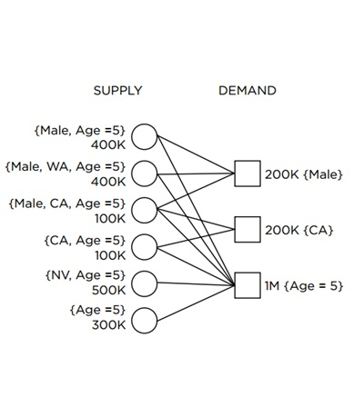

合约广告是一种基于合约的广告模式，在线广告中的一种主流方式是担保式投放（Guaranteed Delivery，GD）。GD是一种量优于质的广告投放方式，需要保证广告主能够获得在合约中约定的受众用户的流量。GD中，媒体的流量按照属性划分，媒体要给不同的广告主按照合同分配约定好的流量。Ad Server的准则是希望在每一次展现满足多个合约时，选择合适的广告主，以使得每个广告主效果最好，同时能够更有效的分配流量。如下图所示，supply为媒体方，提供流量，媒体的流量可以按照性别、年龄、地域划分；demand为广告主，不同的广告主需要不同细分的流量（或者说流量背后的用户），比如第一个广告主需要200K的男性流量。流量分配问题就是把不同细分的流量分配给不同的广告主，尽可能满足所有广告主的需求。比如下图中的问题，怎样把六部分流量分配给三个广告主才能满足所有广告合约的需求了？我们可以先分配CA的流量都给第二个广告主，然后就比较容易分配流量给另外两个广告主了。

